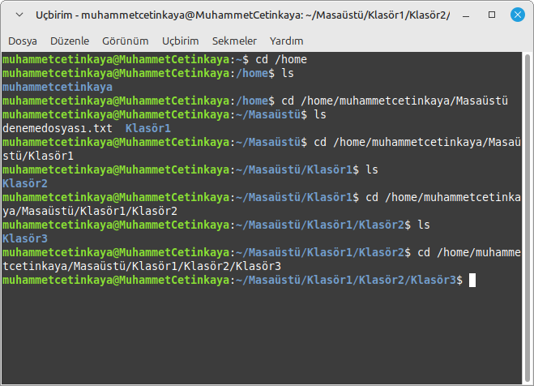
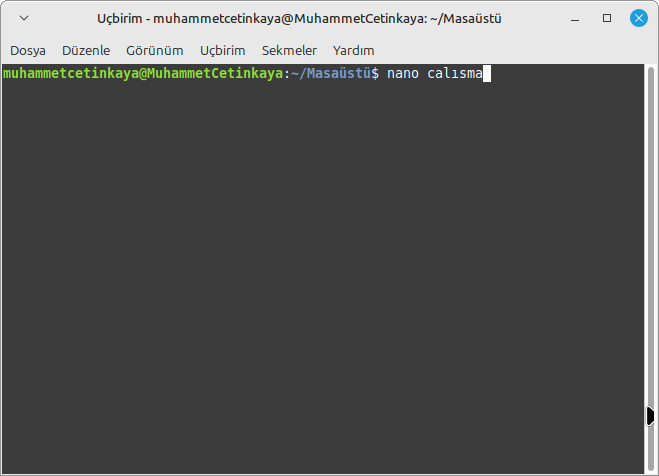
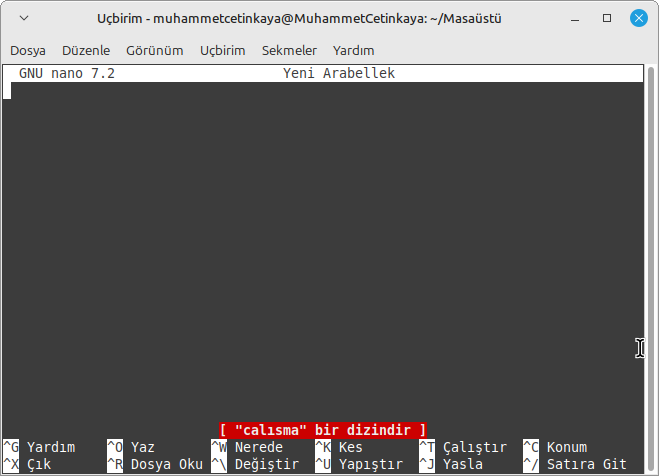
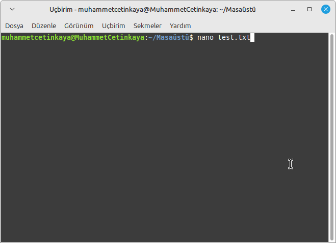
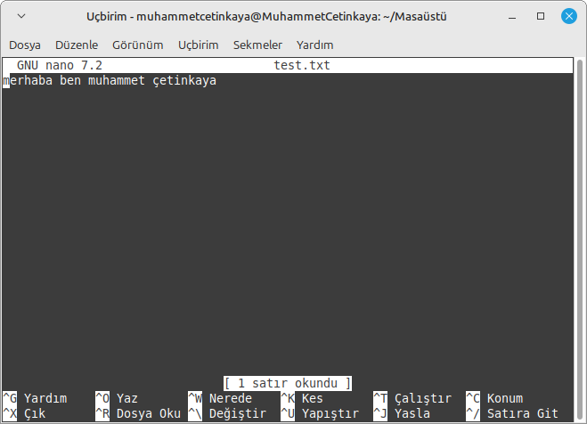

# Linux Terminal Komutları 

Kısaca söylemek gerekirse Linux terminal komutları, kullanıcıların işletim sistemini doğrudan komut satırından yönetmesini sağlıyor. Bu komutlar sayesinde dosya düzenleme, sistem ayarlarını değiştirme, yazılım kurma ve güncelleme gibi işlemler hızlıca yapılabiliyor. Grafik arayüze ihtiyaç duymadan, esnek ve güçlü bir kontrol sunan terminal komutları, özellikle sistem yönetimi, otomasyon ve ağ işlemlerinde etkili bir çözüm sunuyor. Terminal sayesinde sistem üzerinde tam hakimiyet sağlayarak işleri daha verimli hale getirmek mümkün.

_Cinnamon.png)

## Hangi Komut Hangi Konu Başlığına Girer

#### Dosya İçeriği Görüntüleme ve Düzenleme Komutları 🗃️:

Cat Komutu , Head Komutu , Tail Komutu , Tac Komutu , Nano Komutu , Sed Komutu , Grep Komutu , Cut Komutu

#### Disk ve Sistem Yönetimi Komutları 💾:

Df Komutu , Du -sh Komutu , Free Komutu , Top Komutu , Htop Komutu , Vmstat Komutu , Uptime Komutu , Ps Komutu , Whoami Komutu , Who Komutu

#### Ağ Komutları 🛜 :

Ping Komutu , Traceroute Komutu , İp -a Komutu , Netstat -tuln Komutu , Dig Komutu , İfconfig Komutu

#### Paket Yönetimi ve Yazılım Komutları 🧑‍💻:

Apt Komutu , Sudo apt Komutu , Sudo Komutu

#### Sıkıştırma ve Arşivleme Komutları 🗄️:
Gzip Komutu , Gunzip Komutu , Tar Komutu , Zip Komutu , Unzip Komutu

#### Bilgi ve Yardım Komutları :
Man Komutu , History Komutu , Alias Komutu , Neofetch Komutu , İnxi -F Komutu , İnxi -G Komutu

#### Dosya Güvenliği ve Şifreleme Komutları 🔐:

Shred -u Komutu , Chmod Komutu , Passwd Komutu

#### Çeşitli Yardımcı Komutlar 💁:

Echo Komutu , Time Komutu , Sort Komutu , Wc Komutu , Jobs Komutu , Env Komutu

## Cd Komutu
Cd komutu terminal üzerinden dizinler arasında gezinmek için kullanılır.

## Cat Komutu
Cat komutu dosya içeriklerini terminalde görüntülemek için kullanılır. 

## Df Komutu
Df komutu dosya sistemindeki disk alanı kullanımını görmek için kullanılmakta ve her bir bağlı dosya sistemindeki toplam alan, kullanılan alan, boş alan ve kullanılan alan yüzdesini göstermektedir.

 

## Cp Komutu
Cp komutu, dosyaları veya dizinleri kopyalamak için kullanılır

## Diff Komutu
Diff komutu  iki dosya arasındaki farkları karşılaştırmak için kullanılır.

## Du -sh Komutu
Du -sh komutu, bir dosya veya dizinin ne kadar yer kapladığını hızlıca öğrenmek için kullanılır.

## Echo Komutu
Echo komutu, terminalde belirtilen bir metni veya değişkenin değerini yazdırmak için kullanılır. 

## Find Komutu
Find komutu, komutu, belirtilen dizin içinde dosya ve dizin aramak için kullanılır.

## Grep Komutu
Grep komutu, bir dosya veya komut çıktısı içinde belirli kelime, ifade aramak için kullanılır.

## Gzip Komutu
Gzip komutu, dosyaları sıkıştırmak için kullanılır. 

## Gunzip Komutu
Gunzip komutu,.gz uzantılı dosyaları açmak (sıkıştırmayı geri almak) için kullanılır. gunzip, gzip ile sıkıştırılmış dosyaları orijinal hallerine geri döndürür.

## Head Komutu
Head komutu, bir dosyanın ilk birkaç satırını görüntülemek için kullanılır. Bu komut, genellikle dosyanın içeriğini hızla gözden geçirmek veya ilk satırlarda bulunan bilgilere bakmak için kullanılır.

## History Komutu
Head komutu,terminalde daha önce çalıştırdığınız komutların geçmişini görüntülemek için kullanılır.

## Htop Komutu
Htop komutu, sistemdeki tüm işlemleri, CPU kullanımını, bellek kullanımını ve diğer kaynakları dinamik olarak görsel olarak gösterir.

## İp -a Komutu 
İp -a komutu, ağ yapılandırmasını ve bağlı olan ağ arayüzlerinin durumunu görüntülemek için kullanılır. 

## Ls Komutu 
Ls komutu, bir dizindeki dosya ve klasörleri listelemek için kullanılır. ls, özellikle dosya sistemi içeriğini hızlı bir şekilde görüntülemek için çok yaygın bir komuttur. Ayrıca
-l  seçeneği, dosyaların ayrıntılı bir listesini gösterirken, 
-a  seçeneği, gizli dosyalar da dahil olmak üzere tüm dosyaları listeler.

## Ln -s Komutu
Ln -s komutu, sembolik bağlantı (symlink) oluşturmak için kullanılır. Sembolik bağlantılar, bir dosyanın veya dizinin başka bir konumda "kısayolunu" oluşturur. Bu, bir dosya veya dizine hızlı erişim sağlamak için kullanışlıdır ve orijinal dosya ya da dizin üzerinde herhangi bir değişiklik yapmadan başka bir konumda da kullanılmasını sağlar.

## Mv Komutu
Mv komutu, dosya/dizin adlarını değiştirmek için yaygın olarak kullanılır.

## Nano Komutu
Nano komutu, dosya bilgisi ve versiyonunu görmek ve yardım almak için kullanılmaktadır.

## Ping Komutu
Ping komutu, bir ağ üzerindeki hedef cihazla iletişim kurmanın ve ağ bağlantısının düzgün çalışıp çalışmadığını test etmenin yaygın bir yoludur.

## Ps Komutu 
Ps komutu, sistemde çalışan işlemleri görüntülemek için kullanılır. Bu komut, kullanıcıya belirli bir anda çalışan tüm işlem bilgilerini sağlar. ps komutunun çıktısı, işlem ID'leri, kullanıcı adı, işlem durumu, CPU ve bellek kullanımı gibi bilgileri içerir.

## Passwd Komutu
Passwd komutu, kullanıcı hesaplarının şifrelerini değiştirmek için kullanılır.

## Rm Komutu
Rm komutu, Linux ve diğer Unix tabanlı işletim sistemlerinde dosyaları ve dizinleri silmek için kullanılan bir komuttur. rm komutu, kalıcı olarak dosyaları siler, yani silinen dosyalar geri alınamaz.

## Sed Komutu 
Sed komutu, metin dosyalarındaki içerikleri düzenlemek, değiştirmek, silmek veya eklemek için kullanılmaktadır.

## Shred -u Komutu
Shred -u komutu, bir dosyayı güvenli bir şekilde silmek için kullanılır ve dosya silindikten sonra dosyanın tamamen sistemden kaldırılmasını sağlar. 

## Sort Komutu
Sort komutu, metin dosyalarını sıralamak için kullanılan bir komuttur. sort, dosyadaki satırları veya verileri belirli bir düzene göre sıralar.

 

## Tail Komutu
Tail komutu, bir dosyanın sonundaki satırları görüntülemek için kullanılan bir komuttur. Bu komut, genellikle büyük log dosyalarını veya veri dosyalarını incelemek için faydalıdır, çünkü dosyanın tamamını görmek yerine yalnızca son birkaç satırını gösterir.

## Top Komutu
Top komutu, sistem kaynaklarını (CPU, bellek, disk kullanımı, vb.) izlemek ve çalışan işlemleri görüntülemek için kullanılan bir komuttur. Bu komut, gerçek zamanlı olarak sistem performansını ve kaynak kullanımını takip etmenize olanak tanır.

## Touch Komutu
Touch komutu, dosya oluşturmak veya mevcut bir dosyanın erişim ve değiştirilme zamanlarını güncellemek için kullanılan bir komuttur.

## Traceoute Komutu
Traceoute komut, verilerin bir hedefe ulaşırken izlediği rotayı, her bir yönlendiriciye ne kadar süreyle ulaşıldığını gösterir. Bu, ağdaki olası tıkanıklıkları veya gecikmeleri tespit etmek için kullanılır.

## Vmstat Komutu 
Vmstat komutu,sanal bellek, işlemci ve sistem kaynakları hakkında istatistikler sağlamak için kullanılan bir komuttur. Bu komut, sistemdeki bellek kullanımı, işlemci performansı, disk ve diğer kaynaklar hakkında anlık bilgiler sunar.

## Whoami Komutu
Whoami komutu, çalıştırıldığı anda oturum açmış kullanıcıyı gösterir. Bu komut, terminal veya komut satırında hangi kullanıcı olarak işlem yapıldığını hızlıca öğrenmek için kullanılır.

## Who Komutu
Who komutu, istemde oturum açmış olan kullanıcıların bilgilerini görüntülemek için kullanılır. 

## Apt Komutu
Apt komutu, yazılım paketlerini kurmak, güncellemek ve kaldırmak için kullanılır.

## Mkdir Komutu
Mkdir komutu, yeni bir klasör oluşturmak için kullanılır.

## Pwd Komutu
Pwd komutu, şu anda bulunduğunuz dizini gösterir. Bu,hangi dizinde olduğunuzu öğrenmek için kullanılır.

## Rmdir Komutu
Rmdir komutu, boş klasörleri siler. Fakat bu klasör boş olmalıdır.

## Sudo Komutu
Sudo komutu, sistemdeki yazılım paketlerinin güncel olup olmadığını kontrol eder ve güncellemeleri yükler. Yönetici yetkileri gerektirdiği için sudo kullanılır.

## Tar Komutu 
Tar komutu, dosya ve dizinleri arşivlemek (sıkıştırmak) veya arşivleri çıkartmak için kullanılır.

Tar-cvf  komutu  dizinindeki dosyaları arşiv.tar adında bir arşive sıkıştırır.

Tar-xvf komutu arşiv.tar dosyasındaki tüm içerikleri çıkartır. -x arşivi çıkarır.

## Wc Komutu
Wc komutu, bir dosyadaki satır, kelime ve karakter sayısını gösterir.

wc -w komutu sadece dosyadaki kelime sayısını verir

## Alias Komutu
Alias komutu, uzun komutları kısaltmak için kullanılmaktadır.

## Stat Komutu
Stat komutu, bir dosya hakkında detaylı bilgi verir (boyut, izinler, son değiştirilme zamanı vb.).

## Dig Komutu
Dig komutu, DNS sorgulamaları yaparak, alan adı bilgilerini almanızı sağlar.

## Uptime Komutu
Uptime komutu, sistemin ne kadar süredir çalıştığını ve yük durumunu gösterir.

.png 'uptime komutu ekran resmi')

## Tr Komutu
Tr komutu, metin dönüştürme işlemlerinde dosyadaki küçük harfleri büyük harfe çevirmek için kullanılır.

.png 'tr komutu ekran resmi')

## Time Komutu
Time komutu, bir komutun çalışma süresini ölçmek için kullanılır.

.png 'time komutu ekran resmi')

## Tac Komutu
Tac komutu, bir dosyanın içeriğini ters sırada (son satırdan başa) görüntüler.

.png 'tac komutu ekran resmi')

## Sudo Apt Komutu
Sudo apt komutu, Bir yazılım paketini kurmak için sudo apt komutu kullanılır.

.png 'sudoapt komutu ekran resmi')

## Neofetch Komutu
Neofetch komutu, sistem hakkında hızlı ve görsel bir özet sunan bir komut satırı aracıdır. Genellikle terminal çıktısında sistemin donanım bilgilerini, işletim sistemi sürümünü, çekirdek bilgilerini, işlemci ve RAM kullanımını ve daha fazlasını gösterir. Ayrıca, terminalde şık ve özelleştirilebilir bir sistem bilgisi görünümü sağlar.

.png 'neofetch komutu ekran resmi')

## Netstat Tuln Komutu
Netstat -tuln komutu, ağ bağlantılarınızı ve ağ servislere ilişkin önemli bilgileri terminal üzerinden görüntülemek için kullanılan bir komuttur. Bu komut, ağda aktif olan bağlantıları, kullanılan portları ve protokolleri göstermek için kullanılır.

.png 'netstattuln komutu')

## Man Komutu
Man komutu, komutlar için kılavuz sayfasını açar.

.png 'man komutu ekran resmi')

## Lsblk Komutu
Lsblk komutu, bağlı olan blok cihazlarını, her cihazın bağlı olduğu partitionları, mount edilmiş dizinleri, dosya sistemlerini ve boyutlarını gösterir. Bu komut, disk yapılarını daha anlaşılır şekilde görmek için kullanılır.

.png 'lsblk komutu ekran resmi')

## jobs Komutu
Jobs komutu, arka planda çalışan işlemleri listelemek için kullanılır.

.png 'jobs komutu ekran resmi')

## İnxi -G Komutu
İnxi -G komutu, grafiksel donanım bilgilerini görüntüler. Bu, sisteminizdeki ekran kartı (GPU) ve grafik sürücüsünün detaylarını içerir.

.png 'inxi -g komutu ekran resmi')

## İnxi -F Komutu
İnxi -F komutu, tam sistem bilgilerini görüntüler. Bu komut, sisteminizdeki donanım bileşenleri hakkında oldukça ayrıntılı bilgi sunar. İşlemci, bellek, ekran kartı, ağ, depolama, işletim sistemi gibi birçok bilgiyi içerir.

.png 'inxi -f komutu ekran resmi')

## Free Komutu
Free komutu, bellek kullanımını görüntülemek için kullanılır.

.png 'free komutu ekran resmi')

## Cut Komutu
Cut komutu, bir dosyadan belirli sütunları veya karakter aralıklarını seçmek için kullanılır.

.png 'cut komutu ekran resmi')

## Env Komutu
Env komutu, ortam değişkenlerini görüntülemek için kullanılır.

.png 'env komutu ekran resmi')